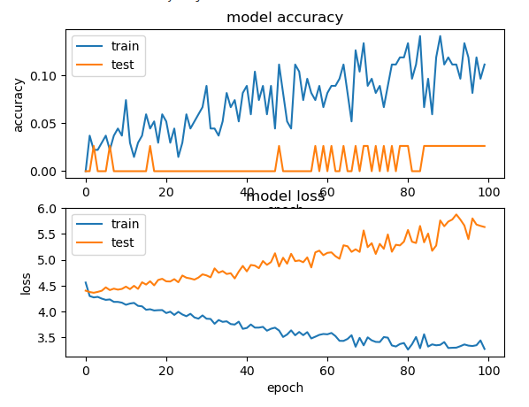

## Initial idea

One of the ideas was to use [YOLOv7](https://github.com/WongKinYiu/yolov7) model. This model can find objects on images and videos and classify them with high accuracy. But later we decided that such model won't fit to our task, as we do not need to find the object on an image, but rather to classify the whole image.

---

## The dataset

Ideally, we would gather a lot of images with different fill levels over a long period of time (around 6 months). But as we do not have that much time, we had to make an imitation of a real dataset. So we took around 200 photos of a bag filled with pellet. If our model proves to be working we can gather a larger amount of data over a longer period of time and use if with the model.

The dataset was split to 74 classes, which represent fill levels between 0 and 100%:

- Train - 70%   
- Validation - 20%  
- Test - 10%  

There was not enough data to fill all 101 classes, so only 74 were used in training

The images were grayscaled and rescaled to 64x64px.

## Model, that didn't work

### General idea:

As we don't have enough data for training we may use a pre-trained model. One of such models is VGG16. It was trained on a very large dataset and its weights are publicly available.

### Plan

1. Extract the bottleneck features from the VGG16 model.
2. Train our own model with the use of the bottleneck for our classes.
3. Save our own model.
4. Use our own model together with the VGG16.

The source code for the model can be found in the form of [jupyter notebook file](./100_class_bottleneck.ipynb)

## Results

This model showed maximum **~2.5%** accuracy during training so it was considered to be non-fitting for out task.