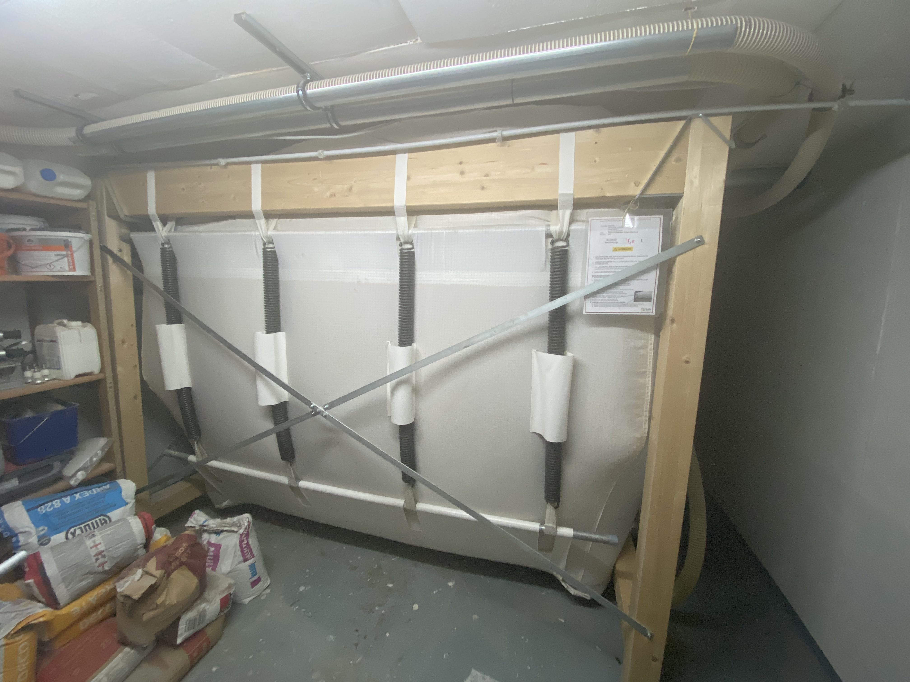

# Determination of pellet silo fill level from the image

AI project of group 13 in the lecture AI at university of applied sciences Bingen.
Group 13 (Lucas Theiß, Tobias Mews, Illia Kremenenko)
---

## The idea

Determine fill level of pellet silo from image

The problem:
- Silo should be refilled every 5 month
- If not refilled – no heating and warm water for the
complete house with 3 apartments

## Future usage of our model

1. Raspberry Pi (zero or pico)
2. Camera and an LED takes a picture of the pellet silo
3. A neural network outputs the fill level in %
4. The number can be sent to HomeAssistant/Email/Telegram etc.

## Data acquisition

- We can't get the real data because of time constraints
- Artificial data could be created with a bag and some pellets
  - Measure the fill level and take a picture
  - Repeat that many times, and you have artificial training data for proof of concept
- Alternatively, we could edit the real images with a program and set a fill level and train with the modified real data.

## Approach to the problem

- Test different frameworks
- Choose the best working framework
- Try out different parameters and algorithms
- Try it with downscaled images to reduce the training time

## What makes this topic relevant?

- It has a real use
- Would help to solve a current problem

---

## How we acquired our data

We used a model with a open box filled with oatmeal.
We took pictures with different fill levels and weight the box to get the fill level in percent.
With that method we got 206 images with the matching fill level and weight in gram.

Generating the data with a simulation was to complicated for the time constraints we had.

## We tested different models to see what model fit our use case the most.

- [Transfer learning](transferLearning/README.md)
- [Linear regression](linearRegression/README.md)
- [10_class_sequential](10_class_sequential/README.md)
- [100_class_sequential](100_class_sequential/README.md)

## Conclusion

The model with [10_class_sequential](10_class_sequential/README.md) worked with the highest accuracy.
We would achieve an even higher accuracy on that module, if we had more data.
But because of time constraints we could not gather more data.
