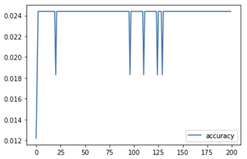

# Linear regression neural network

The Idea was to train a linear regression model, because we need a single number as a output instead of a classification.
That is why we tested a linear regression model.

## Preparation

For the model to work, it needs the images with a number matching to each image as data.
So we uploaded our images and a csv file that matched the images with a number.

## Python code

The python file for Jupyter Notebook can be found [here](linearRegression.ipynb).
We tested different configurations for the neural network, some of them are documented in the Jupyter Notebook.

## Results

The highest accuracy of the configuration we could achieve was 2.4%.

## Conclusion

The method should be the right approach for our problem, but we have not found the correct parameters for the model.