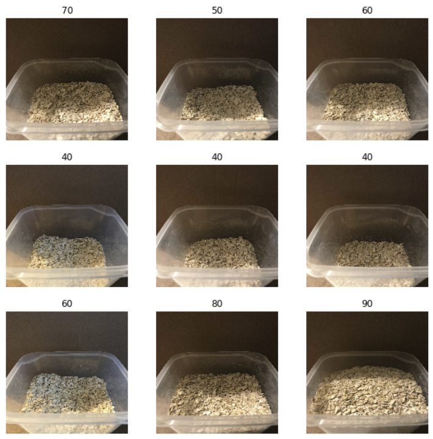
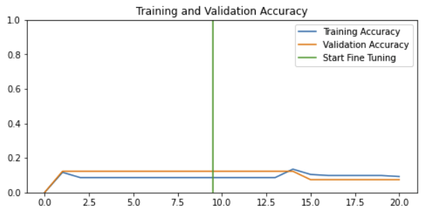
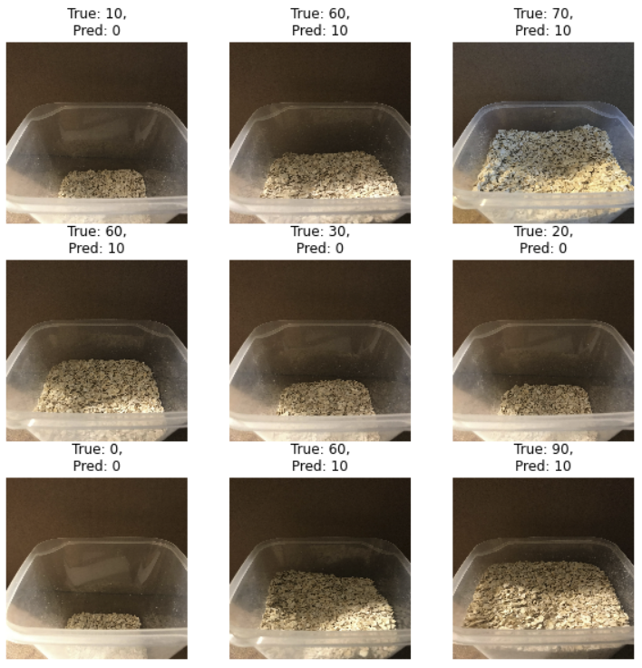
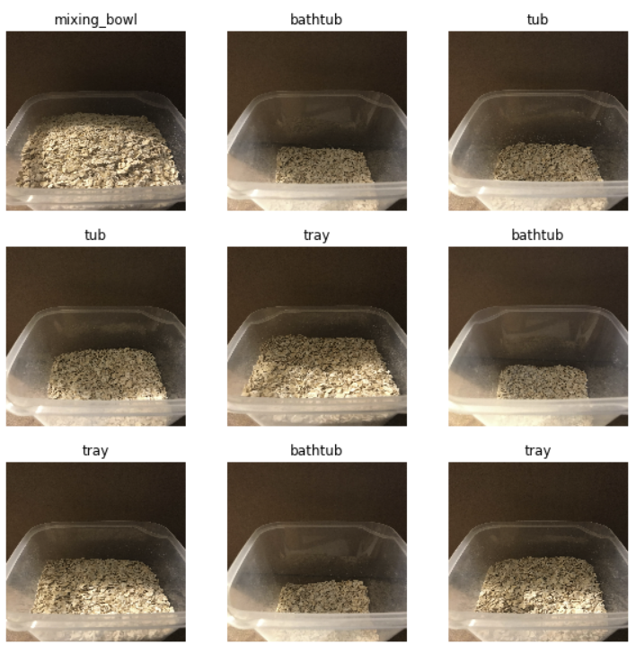

# Transfer learning from image classification network

The Idea was to load the data in an already existing neural network and retrain the last layer.
The existing network is used to classify images in the two classes "alpaca" and "non alpaca".

## Preparation

For the model to work, it needs predefined classifications as folders and the images which belong to those classes
inside the matching folder.
For the initial try we created 10 different classes, each with 10% steps between each other.
So we had folders from 0 up to 90 in steps of 10, to represent the fill level.

## Python code

The python file for Jupyter Notebook can be found [here](transfer_learning.ipynb).
We only made small changes to the parameters, like reducing the RandomRotation to 0.001 and reducing the RandomZoom to
0.1.
We made those changes because our training data, same as the real world data will not vary that much.

## Results

The predictions are only in around 10% of the cases correct.

---
Additionally, the model only predicts fill levels of 0 or 10 and nothing else.

### Reason for the results

It classifies each image with normal words for normal objects instead of "how much of it is filled".
Therefore it predicts the fill level from a set of words that are mostly the same for every image, because the only
thing that changes on the images is the fill level.

## Conclusion

The method of transfer learning based on a image classification model is not suited to predict the fill level of a container based on the image of it.